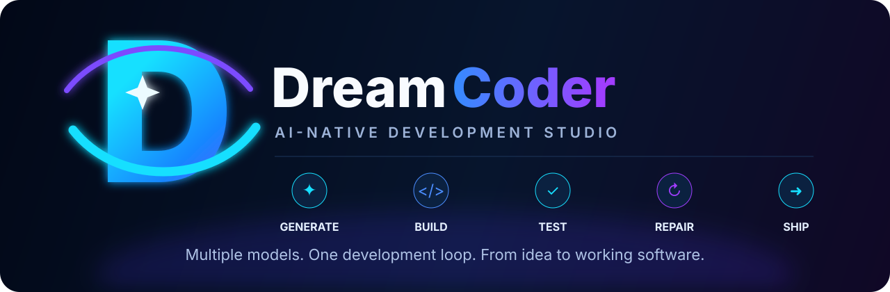
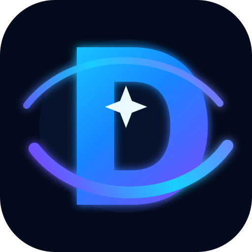

# DreamCoder

<p align="center">
  
</p>

<p align="center">
  <strong>Multiple models. One development loop. From idea to working software.</strong>
</p>

<p align="center">
  <a href="https://github.com/PcButNoBTC/DreamCoder"></a>
  
  
  
</p>

DreamCoder is an **AI-native development studio / IDE** built around the idea that one model should not have to do everything.

It combines a browser/Electron workspace, project-aware context, model routing, specialist task execution, integration, code review, validation, repair, checkpoints, and GitHub workflows into one development loop.

> **DreamCoder turns natural-language intent into a planned, generated, reviewed, validated, and repairable software project.**

---

## ✨ What DreamCoder can do

### 🧠 Multi-model generation

DreamCoder can break a project request into specialist tasks and route each task toward models with the capabilities it needs.

Typical roles include:

- **Planner** — turns the request into an executable task graph.
- **Frontend/UI specialist** — UI and client implementation.
- **Backend/API specialist** — services, endpoints, and server logic.
- **Database/data specialist** — schemas, persistence, and data workflows.
- **Testing specialist** — tests and quality checks.
- **Debugging specialist** — failure analysis and repair.
- **Documentation specialist** — project documentation and reasoning tasks.
- **Integrator** — combines specialist work and resolves conflicts.
- **Reviewer** — reviews the integrated result before validation.

The task graph executes dependency-ready work concurrently where possible.

### 🔀 Capability-based model routing

Instead of hard-coding one model for the entire project, DreamCoder can reason about capabilities such as:

- code generation
- frontend
- backend
- reasoning
- testing
- debugging
- code review
- integration

Provider/model metadata can contribute additional capabilities, allowing the router to select an appropriate available model.

Supported model ecosystems include:

- Ollama
- Hugging Face
- OpenAI-compatible providers
- local/mock development modes

### 🛠️ Build → test → repair

Generated code is not treated as finished simply because a model returned text.

The generation engine can:

1. generate specialist outputs
2. integrate them
3. review the result
4. validate/build it
5. capture failures
6. send concrete validation context to a repair model
7. retry validation

The current repair loop supports multiple language/build strategies and can also use a project-specific build/test command.

### 🧩 Project-aware context

DreamCoder maintains project context through its local project index and can use indexed files/symbols when planning and generating.

This is the foundation for increasingly incremental, project-aware development rather than isolated prompt/response generation.

### 💾 Checkpoints and rollback

Before generated changes are applied to the workspace, DreamCoder can create a checkpoint.

That gives the generation workflow a safety boundary:

```text
Generate
   ↓
Review
   ↓
Validate
   ↓
Checkpoint
   ↓
Apply
   ↓
Rollback if needed
```

### 🖥️ AI development workspace

The project includes a browser-based IDE experience plus an Electron wrapper, with capabilities around:

- code editing
- project browsing
- terminal workflows
- AI chat
- suggestions
- folder analysis
- project agents
- self-healing
- model/provider discovery
- Git workflows
- GitHub synchronization
- workspace checkpoints

---

## 🏗️ Generation architecture

The current generation pipeline looks like this:

```text
                         User Prompt
                              │
                              ▼
                           Planner
                              │
                    ┌─────────┼─────────┐
                    ▼         ▼         ▼
                Frontend   Backend    Testing
                 Model      Model      Model
                    │         │         │
                    └─────────┼─────────┘
                              ▼
                         Integrator
                              │
                              ▼
                           Reviewer
                              │
                              ▼
                      Build / Validate
                         │         │
                       PASS      FAIL
                         │         │
                         │         ▼
                         │       Repair
                         │         │
                         └────┬────┘
                              ▼
                         Generated App
                              │
                              ▼
                          Checkpoint
                              │
                              ▼
                           Workspace
```

The goal is to evolve this into an increasingly autonomous development loop where DreamCoder can inspect an existing project, make targeted changes, test them, repair failures, and present the resulting diff.

---

## 🚀 Quick start

### Windows

From the repository root:

```bat
start_dreamcoder_windows.bat
```

The launcher is intended to start:

- backend: `http://127.0.0.1:8000`
- frontend: `http://127.0.0.1:8001`

### Manual setup

Create a virtual environment and install dependencies:

```bash
python -m venv .venv

# macOS / Linux
source .venv/bin/activate

# Windows
.venv\\Scripts\\activate

pip install -r requirements.txt
```

Start the backend:

```bash
cd backend
python -m uvicorn main:app --host 0.0.0.0 --port 8000
```

Start the frontend in another terminal:

```bash
cd frontend
python -m http.server 8001
```

Then open:

```text
http://127.0.0.1:8001/index.html
```

API documentation:

```text
http://127.0.0.1:8000/docs
```

---

## 🤖 Providers

DreamCoder is designed to work with a mixture of local and remote model providers.

### Ollama

Run Ollama locally, then configure/discover models through the DreamCoder UI or environment configuration.

Typical model names look like:

```text
ollama:qwen2.5-coder
ollama:llama3.1
```

### Hugging Face

Hugging Face model IDs can be routed through the provider layer, for example:

```text
hf:owner/model-name
owner/model-name
```

### OpenAI-compatible endpoints

OpenAI-compatible providers can be configured through the provider/runtime settings used by DreamCoder.

The exact provider availability depends on the local environment and credentials.

---

## 🔗 GitHub integration

DreamCoder can work with GitHub repositories and optionally synchronize workspace changes.

Common environment variables:

```bash
GITHUB_TOKEN=...
DREAMCODER_GITHUB_REPO=PcButNoBTC/DreamCoder
DREAMCODER_GITHUB_BRANCH=main
DREAMCODER_GITHUB_AUTOSYNC=true
```

The application also contains GitHub OAuth/runtime configuration and repository selection flows.

Use the UI for repository connection and selection when OAuth is configured.

---

## 🧪 Validation and testing

DreamCoder's generation engine has a validation layer for several common stacks, including:

- Python
- C
- C++
- Rust
- Go
- Java
- C#

TypeScript/JavaScript projects can use project-specific commands where appropriate.

Project-specific commands can be configured through DreamCoder settings:

```text
project_build_command
project_test_command
```

For example:

```text
npm test
pytest
cargo test
go test ./...
```

Use commands appropriate for the project and environment.

### Important

The current repository is under active development. A successful model generation response is **not** equivalent to a production-ready application. Real projects should be built and tested locally after generation.

---

## 📁 Repository layout

```text
DreamCoder/
├── backend/
│   ├── generation/       # generation task graph + orchestration
│   ├── agent/            # project agent runtime
│   ├── models/           # model abstractions
│   ├── main.py           # FastAPI application
│   ├── ai_router.py      # model/provider routing
│   ├── generator.py      # project generation integration
│   ├── project_index.py  # project indexing/context
│   └── ...
├── frontend/             # browser IDE
├── electron/             # desktop wrapper
├── assets/               # DreamCoder branding
├── scripts/              # helper scripts
├── tests/                # automated tests
├── requirements.txt
├── pytest.ini
├── SETUP.md
├── CHANGES.md
├── PRODUCTION.md
└── README.md
```

---

## 🎨 Branding

The project logo is available at:

**`assets/dreamcoder-logo.svg`**

The GitHub/README banner is:

**`assets/dreamcoder-banner.svg`**

The logo is designed to work as the project's primary visual identity, while the banner is intended for GitHub, documentation, and project presentations.

---

## 🧭 Current development direction

DreamCoder has moved beyond the initial orchestration foundation. The next phase is focused on making the system reliable under real project workloads.

### Immediate priorities

1. Run the complete repository test suite in a properly provisioned environment.
2. Exercise real multi-model generation flows.
3. Verify Ollama/Hugging Face/provider routing.
4. Inject build/test failures and verify concrete repair behavior.
5. Verify workspace checkpoints and rollback.
6. Inspect generated diffs for preservation of existing project code.
7. Add/strengthen CI coverage.
8. Improve patch-based incremental generation.
9. Add generation job status and streaming progress.
10. Improve provider reliability, cancellation, retries, and observability.

### Longer-term direction

The larger goal is an AI-native development environment where DreamCoder can:

```text
Understand project
      ↓
Plan change
      ↓
Select specialists
      ↓
Generate targeted changes
      ↓
Integrate
      ↓
Review
      ↓
Build / test
      ↓
Repair
      ↓
Show diff
      ↓
Apply / rollback
```

That means DreamCoder becomes more than a code generator: it becomes a **development loop around the entire project**.

---

## 🛡️ Development philosophy

DreamCoder is designed around a few principles:

- **Model-agnostic** — use the models available to you.
- **Capability-driven** — match work to model strengths.
- **Project-aware** — understand the codebase before changing it.
- **Validation-first** — generated code must face real checks.
- **Repairable** — failures become inputs to the next attempt.
- **Recoverable** — checkpoints provide a safety boundary.
- **Incremental** — prefer targeted changes over unnecessary regeneration.
- **Human-controlled** — the developer remains in charge of applying and shipping changes.

---

## 📌 Project status

DreamCoder is an **active development project**.

The multi-model generation foundation, task graph, capability routing, integration/review stages, validation/repair loop, incremental context, checkpointing, and generation UI are implemented on `main`.

The next milestone is to validate those systems against real projects and harden the implementation based on observed failures.

---

## 📄 License

See the repository's license file for the current licensing terms.

---

<p align="center">
  
</p>

<p align="center">
  <strong>DreamCoder</strong><br>
  <em>Build bigger. Together.</em>
</p>
